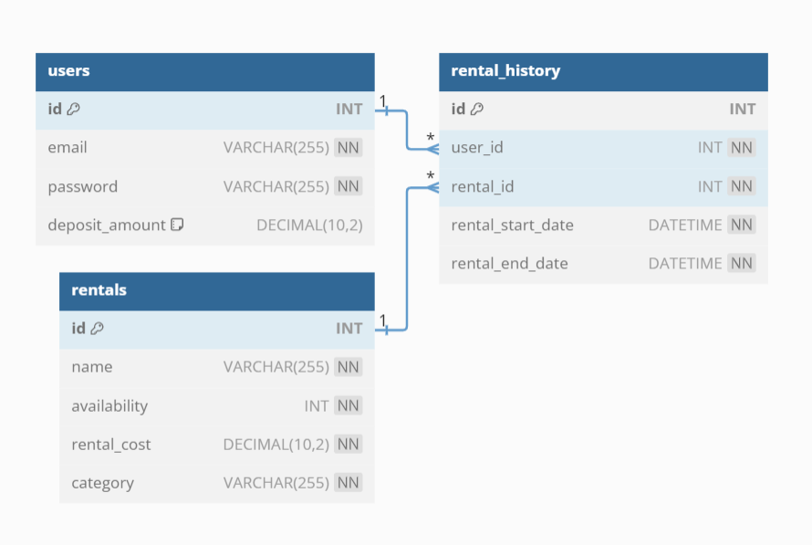

# Rentalind Book App 📔
## Project Description
Rentalind Book App is a REST API application for managing book rentals. Developed using Golang and a MySQL database, this application allows users to rent books, view rental history, and manage their accounts.

## File Description
- **CMD**: Contains the main application logic
- **models**: Defines the core entities or models used throughout the application.
- **config**: Houses the configuration settings for the application.
- **controllers**: Contains the logic for handling API requests and responses.
- **handlers**: Manages routing and maps HTTP requests to the appropriate controllers.
- **Routes**: API Endpoint.
- **testing**: Contains unit and integration tests to ensure the application's reliability.

## Application Features
- User registration and login
- Book rental system
- View rental history
- Manage user accounts
- Payment integration with Stripe
- Email notifications for important events (rental confirmation, reminders)

## API Endpoints
### Users
- **POST /users/register**: Create a new user account.
- **POST /users/login**: Login account as a user.

### Books
- **POST /books**: Create a new book.
- **GET /books**: Retrieve a list of all books.
- **GET /books/:id**: Retrieve a specific book by ID.

### Others Endpoint
- **POST /topup/user/:id**: Create a new topup transaction.
- **GET /rentals/:id**: Retrieve a specific rental history by ID.
- **GET /booking-report**: Retrieve all rental history.
- **GET /booking-report/user/:id**: Retrieve a spesific rental history by ID

## Payment Gateway Integration
I will use the Xendit payment gateway API to facilitate seamless transactions within the application.

## How to run
To run the application, follow these steps:

1. Clone the repository:  
   `git clone https://github.com/ghssni/Rentalind-Go-App.git`
2. Navigate to the project directory:  
   `cd Rentalind-Go-App`
3. Install the required dependencies:  
   `go get ....`
4. Set up your MySQL database and import the schema.
5. Update the `config.go` file with your database credentials and Stripe API key.
6. Run the application:  
   `go run main.go`

## Database Schema ERD

## Created By Me
**([Ghassani Tyas](https://www.linkedin.com/in/ghtyas/))**