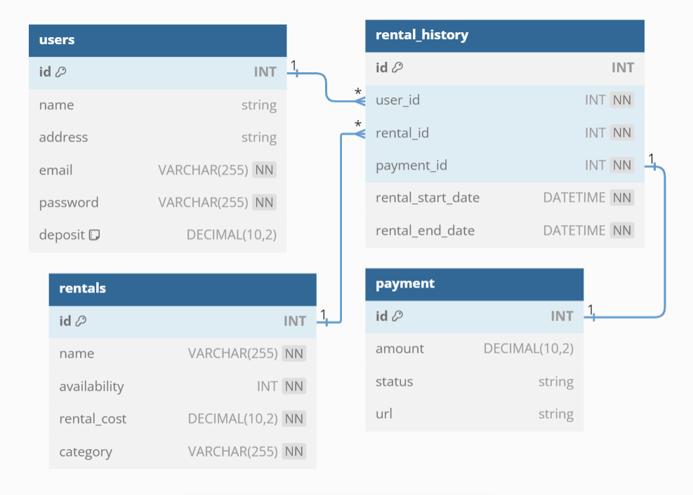

# Rentalind Book App 📔
## Project Description
Rentalind Book App is a REST API application for managing book rentals. Developed using Golang and a MySQL database, this application allows users to rent books, view rental history, and manage their accounts.

## File Description
- **main.go**: Contains the main application logic and API endpoints.
- **models**: Defines the core entities or models used throughout the application.
- **controllers**: Contains the logic for handling API requests and responses.
- **repositories**: Responsible for data access logic and interacts with the MySQL database.
- **utils**: Contains utility functions and helper code used throughout the application.
- **config**: Houses the configuration settings for the application.

## Application Features
- User registration and login
- Book rental system
- View and update rental history
- Manage user accounts
- Payment integration with Stripe
- Email notifications for important events (rental confirmation, reminders)

## API Endpoints
### Users
- **POST /users**: Create a new user account.
- **GET /users**: Retrieve a list of all users.
- **GET /users/:id**: Retrieve a specific user by ID.
- **PUT /users/:id**: Update a user account.
- **DELETE /users/:id**: Delete a user account.

### Books
- **POST /books**: Create a new book.
- **GET /books**: Retrieve a list of all books.
- **GET /books/:id**: Retrieve a specific book by ID.
- **PUT /books/:id**: Update a book.
- **DELETE /books/:id**: Delete a book.

### Rental History
- **POST /rentals**: Create a new rental.
- **GET /rentals**: Retrieve a list of all rentals.
- **GET /rentals/:id**: Retrieve a specific rental by ID.
- **PUT /rentals/:id**: Update a rental.
- **DELETE /rentals/:id**: Delete a rental.

## Payment Gateway Integration
I will use the Stripe payment gateway API to facilitate seamless transactions within the application.

## How to run
To run the application, follow these steps:

1. Clone the repository:  
   `git clone https://github.com/ghssni/Rentalind-Go-App.git`
2. Navigate to the project directory:  
   `cd Rentalind-Go-App`
3. Install the required dependencies:  
   `go get ....`
4. Set up your MySQL database and import the schema.
5. Update the `config.go` file with your database credentials and Stripe API key.
6. Run the application:  
   `go run main.go`

## Example Use Cases
- **User registration**:  
   `curl -X POST -H "Content-Type: application/json" -d '{"email": "user@example.com","password": "password"}' http://localhost:8080/users`
- **Book rental**:  
   `curl -X POST -H "Content-Type: application/json" -d '{"book_id": 1, "rental_date": "2023-03-01", "return_date": "2023-03-15"}' http://localhost:8080/rentals`
- **Email notification**:  
   `curl -X POST -H "Content-Type: application/json" -d '{"user_id": 1, "book_id": 1, "rental_date": "2023-03-01", "return_date": "2023-03-15"}' http://localhost:8080/notifications`

Note: This is just a basic example and you should add more functionality and error handling to your application.

## Database Schema ERD

## Created By Me
**([Ghassani Tyas](https://www.linkedin.com/in/ghtyas/))**